## One-class classification of a Sentinel-2 image with R ##

### Overview ###

In this lecture you will learn how to perform a one-class classification using a Sentinel-1 and a Sentinel-2 image in R.  We will conduct two classifications, one focusing on pixel level (using Sentinel-2 data) and one focusing on object-level (using Sentinel-1 data). The learned processing steps include:

- Loading the Sentinel-data and the training data
- Training the one-class-classification algorithm in a pixel-based and a object-based approach
- mapping the class of interest

## Pixel-based one-class-classification ##

### Datasets used in this Tutorial ###

The datasets applied the tutorial are available here:

[https://drive.google.com/file/d/1WY7vkxUOc3qUIBGqtVpVwYP4nkycYWJw/view?usp=sharing](https://drive.google.com/file/d/1WY7vkxUOc3qUIBGqtVpVwYP4nkycYWJw/view?usp=sharing)

In this tutorial we will the data contained in the subfolder "pixel". We will use a Sentinel-2 image and two shapefiles created in QGIS. One contains some points representing the target class (grasslands) and another one containing the background class (see below for details)

### Step 1: Loading packages and Sentinel-2 data  ###

As first step, load all necessary R packages by executing the following code:

	require("terra")
	require("sf")
	require("rgdal")
	require("e1071")
	require("kernlab")
	
In case you receive an error-message, please make sure that you have all packages installed.

Next, we will load the Sentinel-2 image using the steps you already know from the two proceeding Tutorials. We will use the same Sentinel-2 scene that you already applied in the last Tutorial:

	setwd("D:/Remote_Sensing/1_Fernerkundung/One_class_classification")
	img <- rast("s2_10m_constitucion_sub2.tif")

Just for the fun of it, we can have a quick look using a RGB plot:

	plotRGB(img, r=3,g=2,b=1, stretch="hist")

### Step 2: Loading training data and extract pixel values  ###

Next we will load and plot the training data for the target class and the background data. As you have learned in the lecture today, a one-class-classifier is a special form of a supervised classification where clearly defined training data is only required for the class of interest (**positive** **class**). There are then three versions of one-class-classifiers with respect to additional training data. The first version requires no additional training data. The second version of classifiers requires additional training data of the **negative** **class** (that is, all land-cover classes that are not the target class without further detailed specifications). The third version, which we will also investigate in this study, requires so called "**background** training data".

In the remote-sensing context, background data can be described as a random sample of pixels collected from the complete image extent. Hence, the collection of background data is very straightforward. Be aware that the background class is different from the negative class, as typically, the background data contains both, samples from the positive and negative class.

In this first part of the tutorial, our objective is to identify and map all grassland/pasture areas within the Sentinel-2 image.

We will now load the samples for the positive class (grassland) and the background (random sample of pixels collected over the whole extent of the image) for our classification example:

	# load training data of target class
	target_tr <- vect(".", "grassl") 
	# load background data
	backgr <- vect(".", "backgr")

We can now have a look at the locations of the sample pixels for the grasslands by running:

	plot(target_tr, add=T)

Be aware, that this plot will only work if you have also run the plotRGB command above. In case you did not, run the command now.

This will result in the following plot:

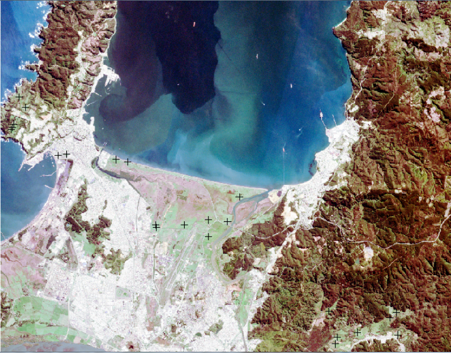

We can of course also visualize the locations of the background pixels by running:

	plot(backgr, add=T, col="red")

Which will result in this plot:

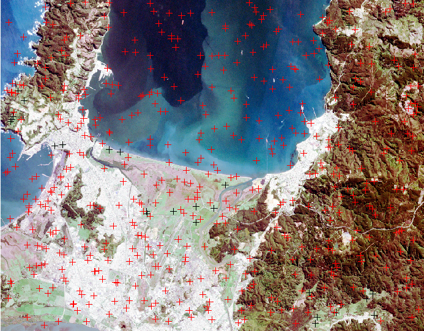

Now, we will extract the pixel values at the locations of the training data for the target class and the background samples:

	tr_data <- extract(img, target_tr, fun=mean)
	all_data <- extract(img, backgr, fun=mean)

You are already familiar with this command from the supervised classification tutorial.

We can have a quick look at the extracted values by running:

	str(tr_data)
	str(all_data)

Which will give us the following two console outputs:

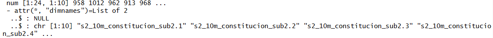

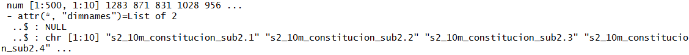

We can see that the training data matrix for the positive class consists of 24 samples for which the corresponding pixel values for the 10 Sentinel-2 bands were extracted. On the other hand, we have a matrix with 500 background points with the same corresponding pixel values for the 10 bands.

### Step 3: Prparing the data and training the one-class classifier  ###

To prepare the classification we will now first add another column to the matrices of the positive and the background class. This column will contain the information concerning the class. As the class is defined as character, we need one additional step, that is the conversion of the matrix to a dataframe. We run the code:

	# convert extracted values to dataframe and add class names
	# target class
	tr_data2 <- as.data.frame(tr_data)
	tr_data2$class <- 'grass'
	# background
	all_data2 <- as.data.frame(all_data)
	all_data2$class <- 'backgr'

Next, we combine the two dataframes to one dataset by running:

	new <- rbind(tr_data2, all_data2)

Then, in the next step, we create two subsets from the just created **new** variable by separating the training data (columns 1-10) from the reference data, we just created (column 11). We actually create two training datasets as we will work with two different one-class-classification implementations. One of them requires only the samples from our target/positive class while the other algorithm requires both, target class and background class:

	# extract bands for training (leave out classes)

	# only samples which represent grass
	trdata_occ1 <- new[new[,11]=="grass",1:10]
	# all training samples
	trdata_occ2 <- new[,1:10]
	# prepare response for all samples (required by one of the two classifiers)
 	resp <- new[,11]=="grass"

We are now ready to train the one-class classification using the **svm**- and **ksvm**-functions (see in code descriptions to understand the differences between the two classifiers):

	# train one class classification model with samples of only the target class
	svm_model_po<-svm(trdata_occ1,y=NULL,
               type='one-classification',
               nu=0.10,
               scale=TRUE,
               kernel="radial")

	# train one class classification model with samples of target and background class
	svm_model_pb=kernlab::ksvm(as.matrix(trdata_occ2), 
	                        y=resp, 
	                        nu=0.09, 
	                        type="nu-svc", 
	                        kernel="rbfdot"
	                      )

### Step 4: Apply the classifier to the full image  ###

The trained one-class-classifier models are stored in the variables **svm_model_po** and **svm_model_pb**. We can now apply those classifier to the complete satellite image by running:

	pred_occ1 <- terra::predict(img, svm_model_po, na.rm=T)
	pred_occ2 <- terra::predict(img, svm_model_pb, na.rm=T)

This process might take a while, depending on the applied image and your computer's performance. 

We can now have a look at the prediction maps by running:

	par(mfrow=c(1,2),oma=c(3,3,3,3))
	plot(pred_occ1) 
	plot(pred_occ2)

This results in the following plot:

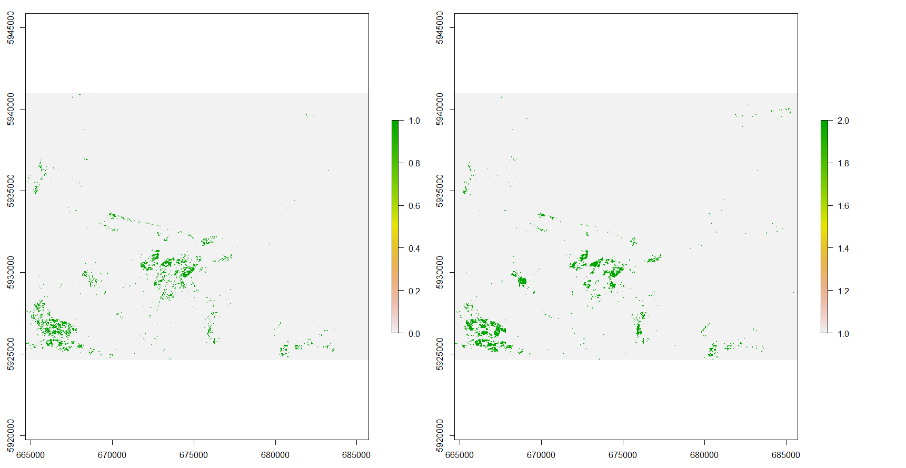

As we can see, the plots look quite similar, but there also some differences visible. We can now check these results in QGIS and compare them to the original satellite data. For this we first have to save the results to raster-files:

	# save prediction map
	writeRaster(pred_occ1, filename="occ_results_po.tif", format="GTiff")
	writeRaster(pred_occ2, filename="occ_results_pb.tif", format="GTiff", overwrite=T)
 
In the resulting raster-file all grassland areas should have the same value (1 or 2) and all other classes another value (0 or 1) . You can load the final classification map to QGIS and overlap the original satellite image with it to check the plausibility of the result. In case you are not happy with the results (too few or too many areas were classified as grassland), you can try to improve the results by changing the **nu** parameter (**nu** takes values between 0 and 1) in the code to train the classifiers. A higher **nu** value will results in more areas to be classified as grasslands, a lower parameter, will result in fewer areas to be classified as grasslands. 

We can furthermore, calculate a confusion matrix based on our original reference data by running:

	# classifier 1
	pos1 <- extract(occ_res1, target_tr, fun=mean)
	neg1 <- extract(occ_res1, backgr, fun=mean)
	
	pos_ref1 <- rep(1, length(pos1))
	neg_ref1 <- rep(0, length(neg1))
	
	confusionMatrix(as.factor(c(pos1, neg1)), as.factor(c(pos_ref1, neg_ref1)))
	
	
	# classifier 2
	pos2 <- extract(occ_res2, target_tr, fun=mean)
	neg2 <- extract(occ_res2, backgr, fun=mean)
	
	pos_ref2 <- rep(2, length(pos2))
	neg_ref2 <- rep(1, length(neg2))
	
	confusionMatrix(as.factor(c(pos2, neg2)), as.factor(c(pos_ref2, neg_ref2)))
	

which will result in the following outputs:

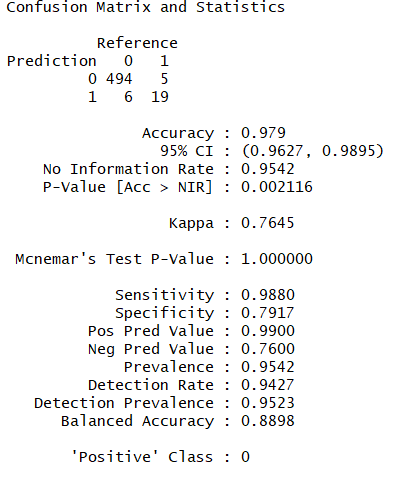

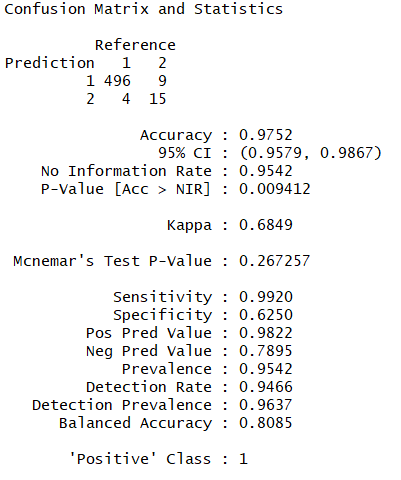

**Exercise:** Try to understand this last piece of code and figure out why this step can be considered problematic. Do we really have a reliable evaluation of the result by running this code?

## Object-based one-class-classification ##

### Datasets used in this Tutorial ###

In this tutorial we will use a dataset of the Sentinel-1 satellite, which has a C-band radar sensor on board. This dataset will look notably different to the satellite images we have used so far. You will hear a bit more about Radar-sensors in one of the upcoming lectures. Fow now, we try to remember that radar data are created using antenna systems and that the final image that we will be using in this Tutorial has already undergone quite a number of processing steps to reach at its current version.

We will furthermore use again two shapefiles, one containing the objects (resulting from a segmentation procedure in the Orfeo-Toolbox which will be presented in class) and a second one, containing a subset of these objects, representing the target class (forests).

The datasets applied in this part of the tutorial are available in the subfolder "object" of the zip-folder which you downloaded in the first part of this tutorial.

### Step 1: Loading all packages and data  ###

The following part of the tutorial will essentially repeat the processing steps of the pixel-based approach with one important difference: The classification will be applied on an object-level instead of on the pixel level.

To start, we load all packages using:

	require("raster")
	require("rgdal")
	require("glcm")
	require("e1071")

To better understand the concept of objects, we now first load the Sentinel-1 image, then the shapefiles containing the objects and then plot the objects on top of the image:

	# jump into directory
	setwd("D:/Remote_Sensing/1_Fernerkundung/One_class_classification/object")
	#load image
	img <- stack("scaled_S1.tif")
	# plot the two bands of the image
	dev.off()
	plotRGB(img, r=1, g=1, b=2, stretch="hist")

This will result in the following plot:

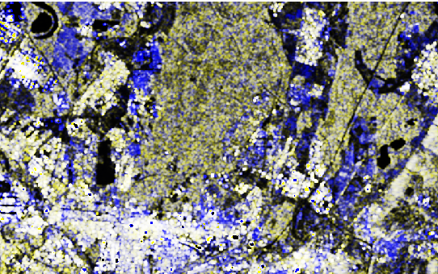

Be aware, that in the given case, we used one band two-times for the plotRGB-command. We did this, because the loaded Sentinel-1 image has only two bands (backscatter values in two differing polarizations) available.  

Next, we load and plot the objects/segments:

	# load segments (positive samples + all samples)
	# jump into directory

	# load segments (whole image)
	segm <- readOGR(".", "small")
	# load training segments of target class
	segm_tr <- readOGR(".", "small_tr")
	# plot the shapefile containing all segments
	plot(segm, add=T) 
 
This will result in the following plot:

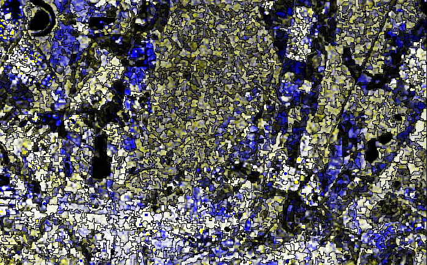

As you can see, the segments are polygons that surround more or less homogeneous areas within the image. This approach has been developed in the remote sensing community (amongst other reasons) to reduce pixel-level noise and create more homogeneous classification results. So far, we only plotted all segments. Now let's have a look at the training data segments:

	plot(segm_tr, add=T, col="red")

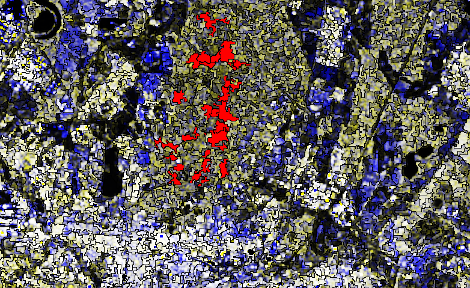

As we can now see, the training data is simply a subset of the earlier shapefile containing all segments.

All of the training segments are located in forested areas, which is the target class in this tutorial.

### Step 2: Extract backscatter values and train classifier  ###

Analogously to the pixel-based classification approach, we will now extract the image-values (in the case of radar data we do not speak about reflectance values but in the given example about backscatter values) on the object or segment-level. That is, the values of all pixels in a given object-polygon will be extracted and we will calculate the mean for each polygon. We would normally run (**!!but** **see** **next** **paragraph!!**):

	tr_data <- extract(img, segm_tr, fun=mean)
	all_data <- extract(img, segm, fun=mean)

This step, takes a notable amount of time, even though the number of objects is quite limited in this example dataset. So sit back, relax and have a cafe... OR alternatively, directly load the already extracted data from a file, prepared for this tutorial. To do this run:

	load("tr_data2.RData")
	load("all_data2.RData")

These datasets were created in an earlier run where after the extraction of the values they were saved to the now opened files using the following commands: 

	#save(tr_data, file="tr_data2.RData") 
	#save(all_data, file="all_data2.RData")
	

The next steps, follow the same procedure as in the pixel-based classification approach:

	# transform the new variable in a dataframe
	tr_data1 <- as.data.frame(tr_data)
	# add a target class to the dataframe
	tr_data1$class <- 'forest'
	
	# repeat the same for the file containing all segments
	all_data1 <- as.data.frame(all_data)
	all_data1$class <- 'abs'

To speed-up the training process, we now build a subset (the background samples) from the **all_data1** variable which contains the extracted backscatter values of all objects (covering the entire image). To do this we run:

	# set a seed to be able to re-produce results
	set.seed(32)
	# draw 150 random samples from the total number of available objects
	s1 <- sample(1:length(all_data1[,1]), 150)
	# build the subset
	back <- all_data1[s1,]

Then we again follow the same steps as applied above to prepare and train the classifier:

	# merge the two datasets
	new <- rbind(tr_data1, back)
	# prepare training and reference data
	
	# only samples which represent grass
	trdata_occ1 <- new[new[,3]=="forest",1:2]
	# all training samples
	trdata_occ2 <- new[,1:2]
	# prepare response for all samples (required by one of the two classifiers)
	resp <- new[,3]=="forest"

Now we can prepare the classifier, following the same principle as used above for the pixel-based example:

	# train one class classification model with samples of only the target class
	svm_model_po<-svm(trdata_occ1,y=NULL,
	                  type='one-classification',
	                  nu=0.10,
	                  scale=TRUE,
	                  kernel="radial")
	
	
	# train one class classification model with samples of target and background class
	svm_model_pb=kernlab::ksvm(as.matrix(trdata_occ2), 
	                           y=resp, 
	                           nu=0.10, 
	                           type="nu-svc", 
	                           kernel="rbfdot"
	)

### Step 3: Apply the classifier to the full image  ###

For applying the classifier to the full image, we in this case do not apply the classifier to the Sentinel 1 image but to the matrix containing the extracted backscatter values for all objects (which cover the entire image).

We run:

	pred_occ1 <- predict(svm_model_po,all_data[,1:2])
	pred_occ2 <- predict(svm_model_pb,all_data[,1:2])

This will result in a binary vector indicating the class-membership of each segment/object, that is, polygon of the shapefile. However, to visualize this result, one more step is missing. We have to attach the final classification result to the attribute table of the shapefile to be able to visualize the result.

To do this, we first copy the shapefile into a new variable by bunning:

	class_res1 <- segm
	class_res2 <- segm

Then we attach the result to the newly ceated shapefile contained in the **class_res** variable by running:

	class_res1$occ_cl <- pred_occ1
	class_res2$occ_cl <- pred_occ2

This piece of code creates a new column in the attribut-table of the Shapefile and writes the corresponding predictions (0 or 1 for the first svm model and 1 or 2 for the second svm model) for each polygon into the attribute table. 

Finally, we plot the shapefile and write it out to a file, to visualize it in QGIS:

	# plot the shapefile, using the classification results to assign colors
	par(mfrow=c(2,1),oma=c(3,3,3,3))
	plot(class_res1, col=class_res1$occ_cl)
	# we substract 1 in the "col" command here because we want to have the same colors for classification 1 and 2 but the resulting values were 0 and 1 in the first classification and 1 and 2 in the second. By substracting 1 in the second case, we also have values of 0 and 1.
	plot(class_res2, col=((class_res2$occ_cl)-1))
	# write out the shapefile to the harddisc
	writeOGR(class_res1, dsn="occ_classification.shp", layer="test", driver='ESRI Shapefile', delete_dsn=T)
	writeOGR(class_res2, dsn="occ_classification.shp", layer="test", driver='ESRI Shapefile', delete_dsn=T)

This will result in:

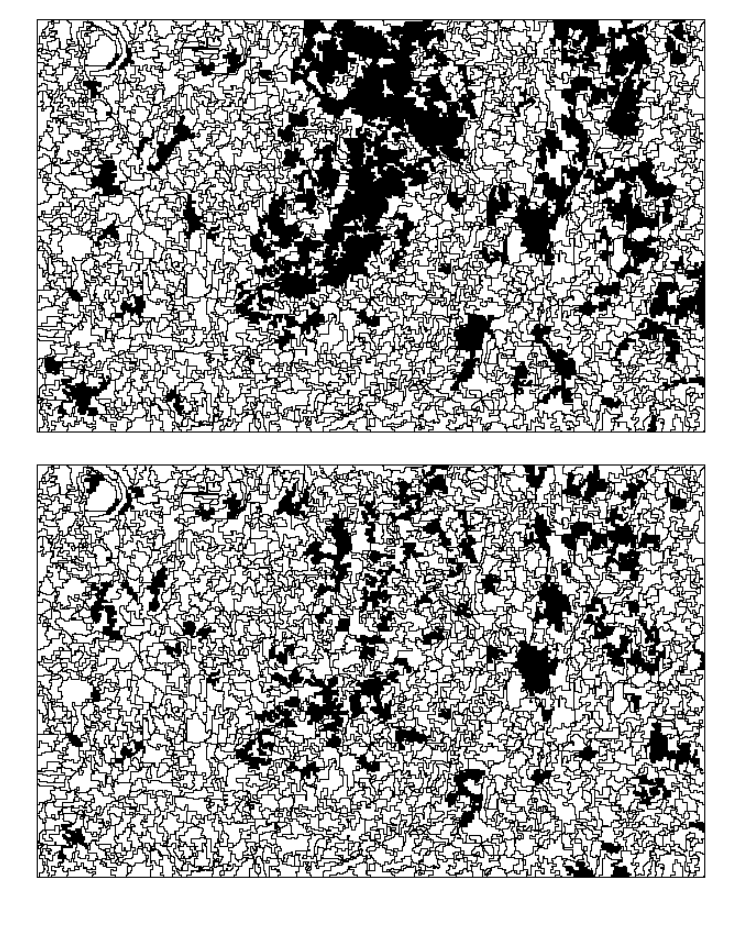

In this plot, the areas classified as forests are visualized in black while the non-forest areas are shown in white. As we can see, the forested areas seem to be somewhat under-classified. We can try to optimize the classification by changing the **nu**-parameter to a higher value. For example you can try to change **nu** from 0.10 to 0.20 in the following part of the code:

	svm_model_pb=kernlab::ksvm(as.matrix(trdata_occ2), 
	                           y=resp, 
	                           nu=0.20, 
	                           type="nu-svc", 
	                           kernel="rbfdot"
	)

and rerun the script to check how the results look like then. The same can also be done for the pixel-based example above to improve the classification results. In the first pixel-based example you can also check how the **nu** parameter accfects the numerical results by having a look how the classification accuracies change when you change the nu-parameter.

**Exercise**: Now implement your own one-class classification using either the Sentinel-1 or the Sentinel-2 image. Select a new target class and adapt your script to isolate the target class from all other classes in the image. Use QGIS to create your training and background data. In case you want to try an object-based classification you can check-out the orfeo-toolbox available at: [https://www.orfeo-toolbox.org/](https://www.orfeo-toolbox.org/) or its stand-alone version MonteVerdi available at: [https://www.orfeo-toolbox.org/tag/monteverdi/](https://www.orfeo-toolbox.org/tag/monteverdi/). The latter contains an algorithm to create a segmentation of any raster-input image.
